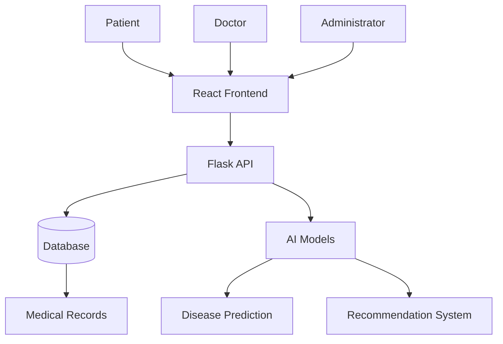

<h1 align="center">
🏥 AI Medical Appointment Platform
</h1>

<p align="center">
An intelligent healthcare platform that leverages Artificial Intelligence to simplify medical appointment management, electronic health records, and clinical decision support.
</p>

<p align="center">


</p>

> **Building AI Course Project**
>
> This project demonstrates how Artificial Intelligence can improve healthcare services by assisting doctors, optimizing appointment scheduling, and providing predictive analytics for better patient care.

---

## 📚 Table of Contents

- [Overview](#-overview)
- [Objectives](#-objectives)
- [Features](#-features)
- [Artificial Intelligence Features](#-artificial-intelligence-features)
- [System Architecture](#-system-architecture)
- [Technology Stack](#-technology-stack)
- [Project Structure](#-project-structure)
- [Installation](#-installation)
- [Usage](#-usage)
- [Security](#-security)
- [Data Sources](#-data-sources)
- [Challenges](#-challenges)
- [Future Improvements](#-future-improvements)
- [Roadmap](#-project-roadmap)
- [Contributing](#-contributing)
- [Author](#-author)
- [Acknowledgments](#-acknowledgments)
- [License](#-license)
- [About](#-about)

---

# 📖 Overview

AI Medical Appointment Platform is an intelligent healthcare management system designed to modernize medical services through Artificial Intelligence and Machine Learning technologies.

The platform helps healthcare providers improve patient care while simplifying appointment scheduling, medical record management, and clinical decision-making.

It provides a secure and user-friendly environment for patients, doctors, and administrators.

---

# 🎯 Objectives

- Modernize healthcare services
- Simplify appointment scheduling
- Improve patient follow-up
- Assist doctors using Artificial Intelligence
- Secure electronic medical records

---

# ✨ Features

## 👤 Patient

- Create a personal account
- Search doctors by specialty
- Book appointments online
- View medical history
- Receive appointment reminders
- Receive treatment reminders
- Secure messaging with doctors

---

## 👨‍⚕️ Doctor

- Manage appointments
- View patient medical records
- Create prescriptions
- Update treatments
- Access AI-assisted recommendations
- Manage consultation history

---

## 👨‍💼 Administrator

- Manage users
- Manage doctors
- Manage appointments
- Monitor platform activity
- Manage security
- Backup database
- Generate statistics

---

# 🤖 Artificial Intelligence Features

The platform integrates several Artificial Intelligence techniques to improve healthcare services.

## Disease Prediction

Predict diseases from:

- Symptoms
- Age
- Gender
- Medical history
- Risk factors

Algorithms:

- Decision Tree
- Random Forest
- Gradient Boosting

---

## Clinical Decision Support

The AI system assists healthcare professionals by recommending:

- Suitable specialists
- Additional medical examinations
- Risk assessment
- Treatment suggestions

---

## Natural Language Processing (NLP)

The NLP module can:

- Analyze patient symptoms
- Extract information from medical reports
- Power an intelligent medical chatbot

---

## Predictive Analytics

The AI models can:

- Identify high-risk patients
- Predict future consultations
- Estimate disease progression
- Predict possible complications

---

## Recommendation System

The recommendation engine provides:

- Medication reminders
- Appointment reminders
- Personalized healthcare advice
- Follow-up recommendations

---

# 🏗️ System Architecture



---

# ⚙️ Technology Stack

## Front-end

- React
- HTML5
- CSS3
- JavaScript

## Back-end

- Python
- Flask

## Database

- MySQL
- PostgreSQL

## Artificial Intelligence

- Scikit-learn
- TensorFlow
- Pandas
- NumPy

## Main Libraries

- Flask
- Flask-CORS
- Scikit-learn
- TensorFlow
- NumPy
- Pandas

## Tools

- Git
- GitHub
- Visual Studio Code

---

# 📂 Project Structure

```text
AI-Medical-Appointment/

│
├── backend/
│   ├── app.py
│   ├── routes/
│   ├── controllers/
│   ├── services/
│   ├── models/
│
├── frontend/
│   ├── src/
│   ├── public/
│
├── database/
│
├── ai/
│
├── data/
│
├── docs/
│
├── images/
│
├── requirements.txt
│
├── README.md
│
└── LICENSE
```

---

# 🚀 Installation

## Prerequisites

Before getting started, make sure you have the following installed:

- Python 3.10+
- Node.js 18+
- Git
- MySQL or PostgreSQL

---

## Clone the repository

```bash
git clone https://github.com/amisaoud-commits/rendez-vous-medical.git

cd rendez-vous-medical
```

---

## Backend Setup

Create a virtual environment:

```bash
python -m venv venv
```

Activate it:

### Windows

```bash
venv\Scripts\activate
```

### Linux / macOS

```bash
source venv/bin/activate
```

Install dependencies:

```bash
pip install -r requirements.txt
```

See **requirements.txt** for the complete list of dependencies.

Run the backend:

```bash
python app.py
```

---

## Frontend Setup

```bash
cd frontend

npm install

npm start
```

or

```bash
npm run dev
```

---

# ▶️ Usage

Once both backend and frontend are running, open your browser and navigate to:

```
http://localhost:3000
```

You can now:

- Register as a patient
- Log in securely
- Search for doctors
- Book appointments
- Access medical records
- Receive AI-powered recommendations

---

# 🔒 Security

Security is a key aspect of the platform.

Implemented features include:

- Secure Authentication
- Password Encryption
- Role-Based Access Control
- Secure Database Connections
- Data Backup
- Audit Logs
- Protection of Sensitive Medical Data

Future improvements:

- Two-Factor Authentication (2FA)
- OAuth Authentication
- JWT Authentication
- End-to-End Encryption

---

# 📊 Data Sources

The AI models may use data from:

- Electronic Health Records
- Laboratory Results
- Medical Imaging
- Clinical Reports
- Medical Prescriptions
- Anonymous Medical Datasets

> **Note:** No real patient data should be used without proper authorization and compliance with applicable privacy regulations.

---

# ⚠️ Challenges

## Technical Challenges

- Data quality
- Model accuracy
- Scalability
- API performance
- Hospital system interoperability

---

## Legal Challenges

- Patient privacy
- Medical confidentiality
- Regulatory compliance
- Data protection

---

## Human Challenges

- User adoption
- AI transparency
- Patient trust
- Ease of use

---

# 🚀 Future Improvements

- Mobile Application (Android & iOS)
- AI Medical Chatbot
- Telemedicine
- Online Payments
- Wearable Device Integration
- Deep Learning Models
- Automatic Medical Report Generation
- Multi-language Support
- Cloud Deployment

---

# 🗺️ Project Roadmap

- [x] Project Planning
- [x] Documentation
- [x] README
- [ ] User Authentication
- [ ] Doctor Dashboard
- [ ] Patient Dashboard
- [ ] Appointment Management
- [ ] Electronic Medical Records
- [ ] AI Disease Prediction
- [ ] Recommendation Engine
- [ ] Medical Chatbot
- [ ] Mobile Application
- [ ] Cloud Deployment

---

# 🤝 Contributing

Contributions are welcome!

If you'd like to contribute:

1. Fork the repository
2. Create a feature branch

```bash
git checkout -b feature/my-feature
```

3. Commit your changes

```bash
git commit -m "Add my new feature"
```

4. Push your branch

```bash
git push origin feature/my-feature
```

5. Open a Pull Request

Please make sure your code follows the project's coding standards and includes appropriate documentation.

---

# 👨‍💻 Author

**Amine Saoud**

Academic Project – Building AI

GitHub: https://github.com/amisaoud-commits

---

# 🙏 Acknowledgments

Special thanks to:

- My Building AI instructor
- My university
- Open-source communities
- Python Community
- React Community
- Flask Community
- TensorFlow Community
- Scikit-learn Community

---

# 📄 License

This project is distributed under the **MIT License**.

See the `LICENSE` file for more information.

---

## 💙 About

This project was developed as part of the **Building AI** course.

Its purpose is to demonstrate how Artificial Intelligence can be integrated into healthcare systems to improve efficiency, decision-making, and patient experience.

Future versions will include more advanced AI models, cloud deployment, and mobile applications.

---

<p align="center">

⭐ If you like this project, don't forget to leave a star!

</p>
